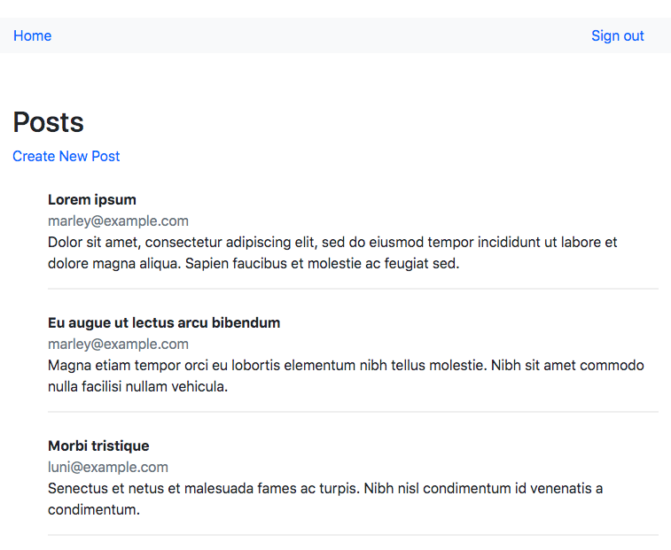

# Members Only

## About

Members Only is a simple Rails application that relies on authentication with Devise to create and view posts. Non-members are able to read posts but only members can see who wrote a post and create posts themselves.

The application is part of The Odin Project's Ruby on Rails Curriculum (http://www.theodinproject.com).




## How to Use

```
$ git clone https://github.com/HannaEb/members-only.git
$ cd members-only
$ bundle
$ rake db:migrate
$ rails server
```
In your browser, enter http://localhost:3000/


## Testing

RSpec-Capybara. To run all the tests, simply run rspec in your terminal.


## Author

HannaEb
